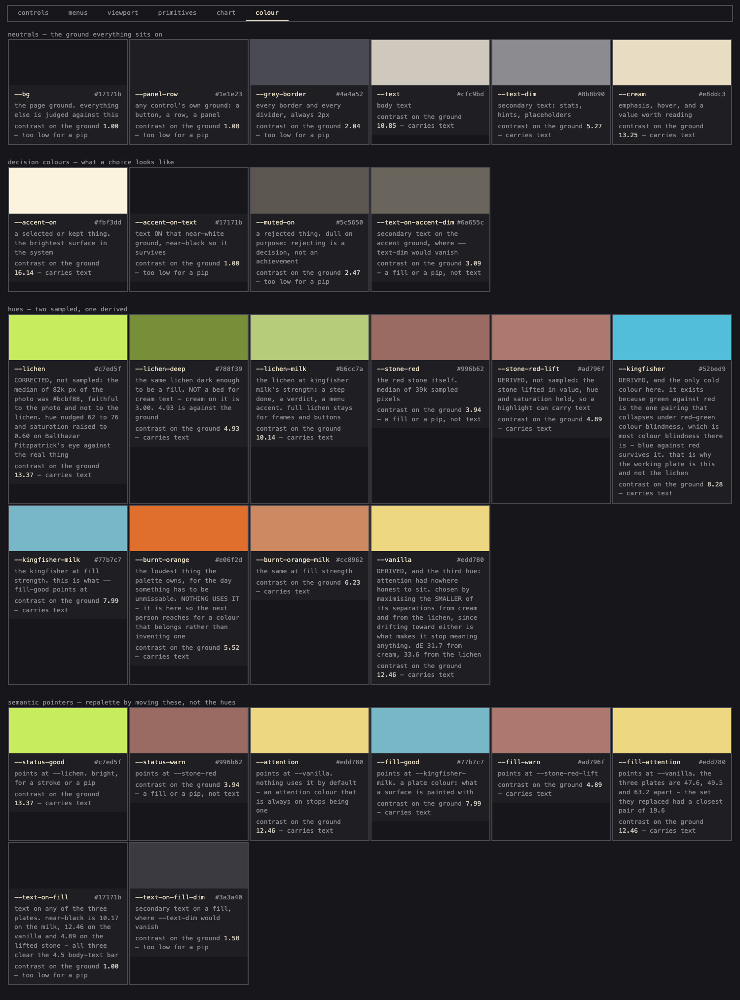
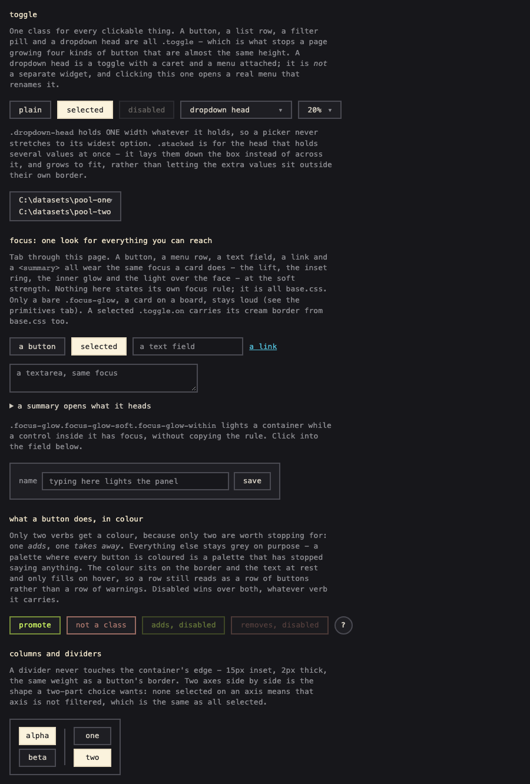
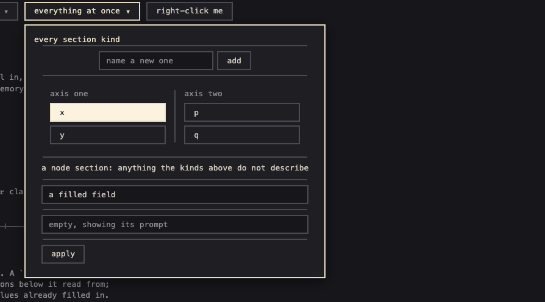
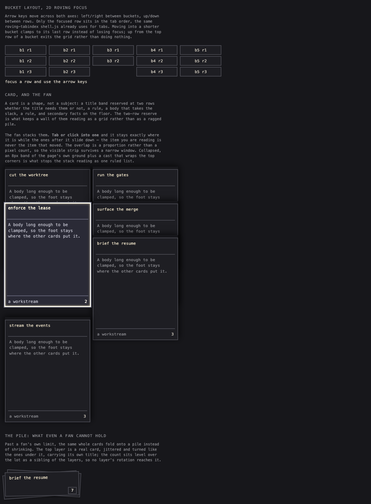

# smortui

**The shared web interface for a family of local tools.** One stylesheet and a handful of plain
scripts - menus, a tab shell, a keyboard-first board layout, cards, drawers, selection, pan and
zoom - that a small Python server hands out so every tool looks and behaves like one product.


<sub>[smortboard](https://github.com/BalthazarFitzpatrick/smortboard) is built from these pieces:
buckets, cards and the fan, drawers, expanders, menus, the focus marker, the palette.</sub>

---

## Install

Requirements: **Python 3.11+** and **uv**. Nothing else - no node, no npm, no build step. A
`<link>` and a few `<script>` tags is the whole integration.

In a tool, pin it by commit (the repo is `smortui`; the Python package inside is `ui_base`):

```toml
dependencies = ["ui_base @ git+https://github.com/BalthazarFitzpatrick/smortui.git@<commit sha>"]
```

Serve its assets from your request handler, then load them in the page. **Order matters**:
`base.css` first so your own stylesheet can override it, and `shell.js` before the script that
calls `initShell`.

```python
from ui_base import content_type, read_asset, UiBaseError

# a path like /ui/menu.js -> "menu.js"; refuses anything outside the assets
try:
    body = read_asset(name)
except UiBaseError:
    ...  # 404
headers = {"Content-Type": content_type(name)}
```

```html
<link rel="stylesheet" href="/ui/base.css">
<link rel="stylesheet" href="/ui/your-layout.css">
<script src="/ui/menu.js"></script>
<script src="/ui/shell.js"></script>
```

`demo/serve.py` is exactly that wiring, so if the demo works, this integration is right.

## Quick start

```bash
git clone https://github.com/BalthazarFitzpatrick/smortui && cd smortui
uv sync
uv run python demo/serve.py --port 8770     # every component on one page
```

## Concepts

### The visual language

Six rules carry the whole look. They are in `base.css`'s header too, where someone about to
override something will be looking.

1. **One row height, app-wide** (`--row-height`). Every row and button is that tall.
2. **One clickable class**, `.toggle`.
3. **Dividers never touch the container edge.** 15px inset, 2px thick - the weight of a button
   border, because a 1px rule beside 2px buttons reads as a different system.
4. **Selection is bright, rejection is muted.** Rejecting is a decision, not an achievement.
5. **Text stays selectable.** `user-select: none` also makes every name and readout uncopyable.
6. **Monospace throughout**, because these tools show filenames, counts and coordinates.

**One font size, everywhere** (`--font-size`); emphasis is carried by colour and by the row a thing
sits in. A test fails the build if a `font-size` is set anywhere but the token. Four more tokens
carry the vertical rhythm: `--gap` between rows in a panel, `--inset` a panel's top and bottom,
`--inset-x` its sides, and `--row-height`. `.h-divider` adds no space of its own - the parent's
`gap` spaces it like any other child.

Override by redefining the tokens, not by fighting the rules.

### The palette



Neutrals do the work: a charcoal ground, a cream for emphasis, and greys between. The hues are kept
few on purpose, because a colour that appears everywhere stops meaning anything. Two families were
sampled from photographs of lichen and stone - each the median of its photo filtered to that hue
band above 22% saturation, so it is the lichen and the stone themselves rather than their blend with
grey. The rest are derived.

**The lichen is the interesting one, because sampling got it wrong.** The photo's median is
`#bcbf88`, faithful to the *photograph* rather than to the lichen: overcast light and phone
processing left no pixel both vibrant and pale. Balthazar Fitzpatrick, who was standing there:
*"much more vibrant, like a pale lime, the photos dont do it justice."* Saturation was raised to 0.60
and the hue nudged 62° → 76° by eye against the real thing. **Measurement fixed the family; only the
person who saw it could fix the rest.**

**Lichen milk** is the same lichen at the strength kingfisher milk already has: pale enough to mark a
finished step, a verdict or a menu accent without shouting over the words. Full lichen stays for
frames and button accents.

**The working plate is cold on purpose.** Green against red is the pairing that collapses under
red-green colour blindness, which is most colour blindness there is, so `--fill-good` points at the
kingfisher milk. `--vanilla` belongs to no photograph: attention needed a colour of its own, and it
was chosen by maximising the smaller of its two separations, from cream and from the lichen.

`--status-good`, `--status-warn`, `--fill-*` and `--attention` point at these, so a repalette moves a
pointer and the record of where each colour came from stays. **Nothing uses `--attention` by
default** - an attention colour that is always on stops being one. The demo's colour tab shows every
token with its contrast, and a test fails if a hue arrives without being named in it.

## Components

| file | gives you |
|---|---|
| `base.css` | the tokens and every primitive: `.toggle`, dividers, columns, panels, rows, cards, the fan, the pile, the focus glow, badges, hazard stripes |
| `menu.js` | `Menu`, `listMenu`, `dirMenu`, `renderTree`, `makeSlider`, `makePanZoom` |
| `shell.js` | `initShell`, `activateTab` - tabs, keyboard nav, remembering where you were |
| `buckets.js` | `makeBuckets` - side-by-side lists with 2D roving focus |
| `expand.js` | `makeExpander` - a strip that grows into a centred panel and back |
| `drawer.js` | `makeDrawer` - a sliver at a screen edge that opens into its half |
| `indicate.js` | `indicateBadge`, `indicateFocus` - a count badge and a gliding focus marker |
| `help.js` | `helpTip` - a round `?` that shows its tip on hover and pins it on click |
| `select.js` | `makeSelection` - click, cmd+click, shift+drag, right-click over a grid |
| `align.js` | `makeAligner` - drag a crop under a fixed guide, `wasd` nudging, live preview |
| `entrytext.js` | `deriveEntryHeader`, `splitEntryParagraphs` - header derivation and small-paragraph splitting for a log-like feed entry |
| `pile.js` | `computeColumnFit`, `computeColumnLayout`, `placeGroup`, `foldFrames`, `pileLayerJitter` - the spread/fan/pile geometry and the fold, all pure |

### Controls



**One clickable class**, `.toggle`, for buttons, list rows, filter pills and dropdown heads. **Only
two verbs get a colour**: one that adds and one that takes away. Everything else stays grey, because
a palette where every button is coloured has stopped saying anything. The colour sits on the border
at rest and only fills on hover.

`.text-field` is an input or a textarea at the same row height and border as a toggle. A textarea
puts its first line where an input would and grows downward from there. Guidance that would wrap a
row as prose becomes a round `?` (`helpTip`): hover to peek, click to pin.

### Menus



One class for every popup - dropdowns, right-click menus, pickers - built from generic sections, so
a new menu is a data structure rather than new code.

```js
new Menu({
  title: 'open a thing',
  columns: false,              // true lays sections side by side, split by a vertical rule
  onDismiss: () => {},         // ALWAYS fires - this is what stops a stale selection surviving
  sections: [...],
}).openAt(triggerElement);     // or .openAt({x, y}) for a right-click
```

| section kind | for |
|---|---|
| `list` | rows with optional `stats`, `on`, `disabled`, `state`, and a trailing `action` |
| `columns` | two or more axes side by side, each with its own `label`, `items`, `empty`, `multi`, `onPick` |
| `add` | a "+ new" row: a text field and a button |
| `field` | a single text input |
| `buttons` | a footer row of actions |
| `node` | content you built yourself, placed and styled by the panel |

The class owns anchoring, viewport clamping, one menu at a time, dismissal on outside click and
Escape, and arrow/Enter navigation. An item's `state` flags become classes on its row. `persistent:
true` is for a menu you work in rather than pick from. `menu.refresh(sections)` rebuilds an open menu
in place, keeping its position and any class you added after opening. `multi` defaults to true in
`columns` and false in a `list`.

### Board primitives



- **Buckets** (`makeBuckets`): arrow keys move across both axes. Only the focused row sits in the tab
  order. Moving into a shorter bucket clamps to its last row; up from the top exits the grid.
- **Card and fan**: a card is a shape, not a subject - a title band reserved at two rows, a rule, a
  body, a rule, a foot. The fan stacks them; the one you focus stays put and the ones after it slide
  down, so the item you are reading is never the one that moved.
- **Expander** (`makeExpander`): a strip grows into a centred panel and shrinks back, reading its own
  rect as the start of the animation. It owns no persistence.
- **Drawer** (`makeDrawer`): a sliver parked at a screen edge that opens into the middle of its half.
- **Badge and focus marker** (`indicate.js`): a count badge hidden at zero, and one marker element
  that glides between focus targets rather than a ring drawn by each. It lands where a moving target
  comes to rest, only the element focused last may move it, and it follows a list that scrolls
  under it.
- **Hazard stripes**: a placeholder for content that is not there yet, so empty reads as "nothing
  here on purpose" rather than "failed to load".

### The focus glow

One class, `.focus-glow`, for a focused *surface* - a card, a tile, a panel - as opposed to a control,
which keeps the plain 2px `:focus-visible` ring. Balthazar Fitzpatrick, seeing it on a board: *"it is
not only the border that glows but the entire card gets that coloured light glow."* That is four
things, and they are only good together, so they ship as one name:

| part | token | what it does |
|---|---|---|
| the lift | `--focus-lift` | draws a touch larger, so it reads as nearer |
| its own ring | `--focus-ring-width`, `--focus-ring-color` | **inset**, so it scales with the lift and is covered by exactly what covers the element |
| the inner glow | `--focus-inner-glow-blur`, `--focus-inner-glow-spread`, `--focus-inner-glow-color` | the ring bleeding inward, at half the width it first shipped at |
| the coloured light | `--focus-light-saturate`, `--focus-light-brightness` | a filter over the whole face, so it lifts the colours already there rather than tinting one hue |

Retune any one of them without restating the others; `--focus-glow-ms` is the transition. The ring is
inset rather than an outline on purpose: an outline sits outside the box, unscaled, and draws over
the neighbour lying on top of it - which is exactly wrong in a fan or a pile. While anything wearing
this has focus, `indicate.js`'s shared marker hides, so the two never draw at once.

**The soft variant.** A surface inside another surface - a section of an open card, a tab in a bar -
is a smaller thing than a card on a board, and the loud treatment on one reads as the whole card
jumping. `.focus-glow.focus-glow-soft` is the quieter version: a modifier that restates those same
six tokens at a lower strength, so the rule above still does the drawing and the two can never drift
into being different treatments.

| part | loud | soft | why |
|---|---|---|---|
| the lift | `1.03` | `1.01` | a third of the distance from neutral - a section inside a panel must not jump |
| the ring | `3px` | `2px` | half, and the same weight as every other border in the system |
| the inner glow | `8px` / `1.5px` | `4px` / `0.75px` | half the blur and spread |
| the coloured light | `1.7` / `1.4` | `1.23` / `1.13` | a third of the distance from neutral, the same rule as the lift |

Two strengths, not six numbers: the lift and the light drop to a **third** of their distance from
neutral, the ring and its glow to a **half** - an edge thinned to a third stops reading as an edge.
Colour and `--focus-glow-ms` are unchanged, which is what keeps it recognisably the same treatment.
A host retunes the soft one exactly as it retunes the loud one, by restating one token.

### The pile and the fan

`pile.js` is the geometry a column uses once its cards stop fitting, and **the rule it exists for is
that a card is never shrunk** - what gives is how the cards meet. One measured choice per column
(`computeColumnFit`), three regimes:

1. **spread** - they all fit whole, exactly `--card-gap` apart, nothing covering anything
2. **fan** - they do not, so the same whole cards overlap and each covered one shows `--stack-peek` of itself
3. **piled** - not even that fits: the very same fan, of the largest group the room allows, with a pile above and a pile below holding the rest

`computeColumnLayout` turns that into rows - which cards are drawn, which are in which pile, how each
one joins the row before it - and `placeGroup` moves the group one card per step, flipping the anchor
only at the two ends. `foldFrames` is the motion onto and off a pile: **the card never travels.** The
edge facing the pile holds where it was drawn and the far one climbs to meet it, the content cut
rather than squashed, so a card is eaten at the pile's own edge instead of sliding through and out
the far side. `pileLayerJitter` hashes an id into one layer's offset and rotation, so the same cards
always draw the same pile.

All of it is pure - no DOM, no knowledge of what a card holds. The host builds the elements, applies
the numbers and plays the keyframes; `base.css` draws the pile (`.card-pile`, its layers, the level
count badge that no layer's rotation reaches) and the `.row-enter` fade.

### Selection

`makeSelection` is click, cmd/ctrl+click, shift+drag and right-click over a grid. Plain click picks
rather than toggling a destructive flag; shift+drag draws a net on screen rather than a range through
the rendered order, because the mismatches you can see sit together on screen.

### Pan, zoom, slider, aligner

`makePanZoom` zooms about the pointer, `reset` fits and centres, and `destroy` lets go of its
window listeners, as `makeSelection`, `makeDrawer`, `makeExpander` and `makeAligner` do. `makeSlider` is an axis with ticks
and an optional distribution drawn over it, so "no results" and "your cut sits above every value"
stop looking identical. `makeAligner` is for last-pixel crop work and owns no persistence.

## Gallery & recipes

`demo/index.html` is the gallery - every primitive above, live, tabbed, and driven the same way a
real page would drive it (`demo/serve.py` proxies `/ui/*` to this package exactly as a consumer's
own server should). Run it with:

```bash
uv run python demo/serve.py --port 8770
```

A **recipe** is a reusable *pattern* built from those primitives - not a new file to add to the
table above, but a documented shape for composing what already exists.

| recipe | what it shows |
|---|---|
| [a preset list that fills sibling fields](docs/recipes/preset-fills-fields.md) | a `list` row that fills the `field` sections beside it, one revealed only for one choice, each row's own number computed live |
| [a directory browser menu](docs/recipes/directory-browser.md) | `dirMenu` drilling through folders from a host-supplied `fetchDir`, so the package never learns where the tree lives |
| [a two-by-two button grid](docs/recipes/button-grid-2x2.md) | four equal buttons from `.toggle` and a two-column grid, handlers bound by id |
| [stepper rows](docs/recipes/stepper-rows.md) | labelled `-`/`+` rows from `.run-controls.stepper`, one handler for the stack |
| [a split toolbar row](docs/recipes/split-toolbar-row.md) | controls left, `.spacer`, primary actions alone on the right |

Each recipe has a live block in the gallery (find it by title in the matching tab) and a doc under
`docs/recipes/`. The set is also indexed at `docs/recipes/index.json` - a small, stable manifest an
agent can read before loading this file or the gallery at all; its schema is in `CLAUDE.md`.

## Security

`read_asset` resolves the requested path and checks it is still inside the asset folder, rather than
string-matching on `..` - the only reliable test, and the classic hole in a route that concatenates a
caller's name onto a directory. `demo/serve.py` is exactly that wiring, so if the demo works, the
containment check is doing its job.

A menu row's name, stats and badges - and every other piece of tool-supplied text drawn by
`menu.js` - are set with `textContent`, never `innerHTML`, so data from a tool cannot inject markup
through a label. The scripts write no `style="..."` attributes and call neither `eval` nor `new
Function`, so a host can run a strict Content-Security-Policy with `script-src 'self'` and
`style-src 'self'`.

## Implementation

The repo is one Python package (`ui_base`) plus its assets:

```
ui_base/
  __init__.py     # ASSETS, read_asset, UiBaseError
  assets/         # base.css and the scripts, served as-is
```

No build step: the assets are the files a browser loads, unminified and unbundled. A host serves
its own files first and falls back to `read_asset` for anything it does not override, so one tool
can replace a single file by name without editing the package the others read.

A tool consumes it by pinning a tag or commit sha in its `pyproject.toml` (see Install above;
`CHANGELOG.md` says what each tag changed for a consumer), the same way
it would pin any other dependency - `uv sync` fetches that exact revision, so an update to smortui
never moves a tool's build without that tool's own commit changing.

### Why it is a project rather than a copy

Every behaviour here was paid for by a real failure in a tool first:

- a popup with no dismiss handler left a stale selection alive, which the next right-click swept up
  and applied - so `Menu` always fires `onDismiss`
- a shared dismiss handler hardcoded its trigger ids, so every new menu closed on its own opening
  click until it was added
- `reset view` set the scale back and left the pan alone - so reset centres too
- with shift held, a browser sends the wheel as `deltaX`, so shift+scroll only ever zoomed out
- the focus marker left a timer and a listener behind on every element it visited, and a fast run of
  arrow keys through a fan came due late and dragged it back to cards focus had already left

Copying the files copies the code and loses the reasons. The reasons are most of the value, so they
live in the comments and travel with it. Used by
[smortboard](https://github.com/BalthazarFitzpatrick/smortboard) and a screenshot review tool, both
consuming it as a package.

## Development

```bash
uv run pytest            # asset serving, the palette and stylesheet guards, and every tests/js
                         # runner under node - a script's behaviour against a stub DOM
node tests/js/menu_sections.mjs   # one runner on its own, while working on that script
uv run ruff check . --fix && uv run ruff format .
```

Every component that listens on `window` returns `destroy()`; a host that mounts once per page can
ignore it, a host that rebuilds must call it.

## Licence

MIT - see [LICENSE](LICENSE).
